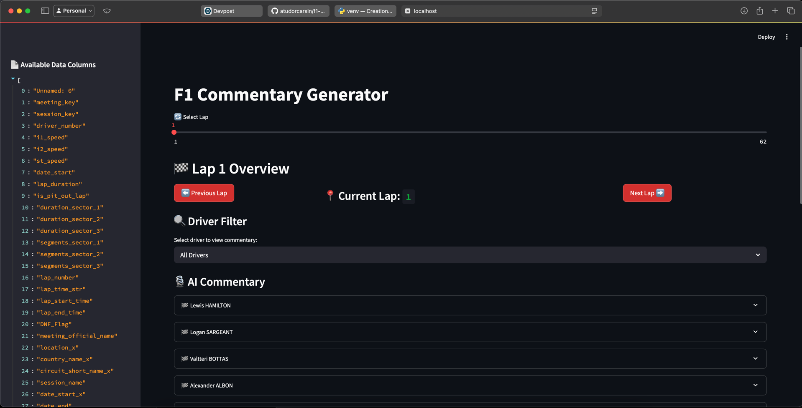

# f1-commentary
Bit Camp 2025 Project




## Description

Generate F1 commentary based on data provided through a CSV file. Extract real world data from the OpenF1 API and generate commentary using the Gemini AI model.

## Pre-requisites
- [Python](https://www.python.org) (3.13)

## Usage

1. Create a [Python virtual environment](https://docs.python.org/3/library/venv.html)
    ```bash
    python -m venv venv
    source venv/bin/activate  # On Windows: venv\Scripts\activate
2. Install the required packages (requirements.txt)
    ```bash
    pip install -r requirements.txt
3. Create a .env file with the GEMINI_API_KEY field
    ```bash
    echo "GEMINI_API_KEY=your_api_key" > .env
3. Create input file for Gemini by running Prepare_Data.py
    ```bash
    python Prepare_Data.py
4. Run gemini.py to generate short commentary for each row in the CSV file
    ```bash
    python gemini.py
5. Run f1_dashboard.py to generate a streamlit app that displays the commentary
    ```bash
    streamlit run f1_dashboard.py
6. That's it! You can now view the commentary by opening Streamlit in your browser